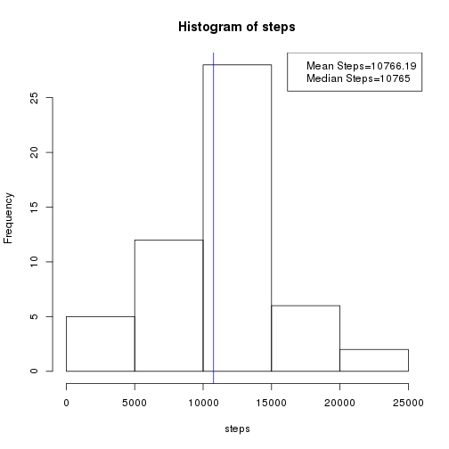
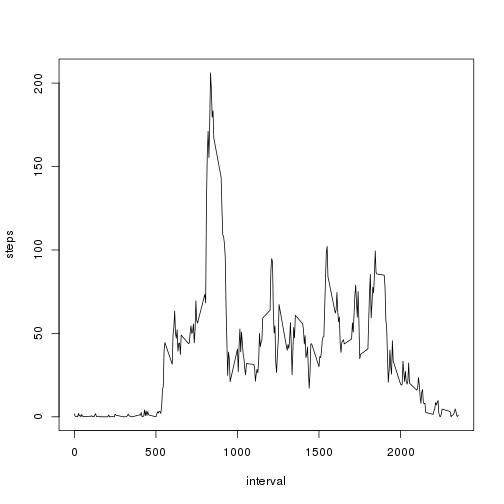
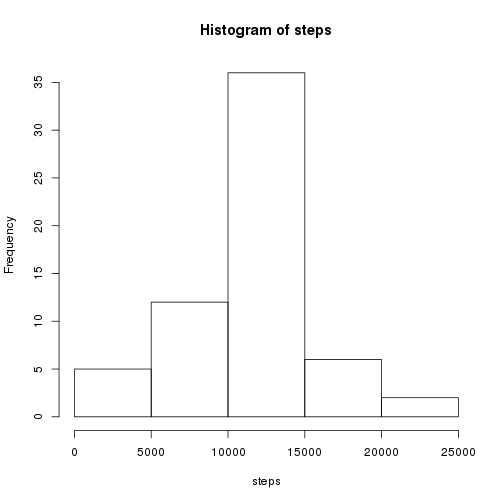
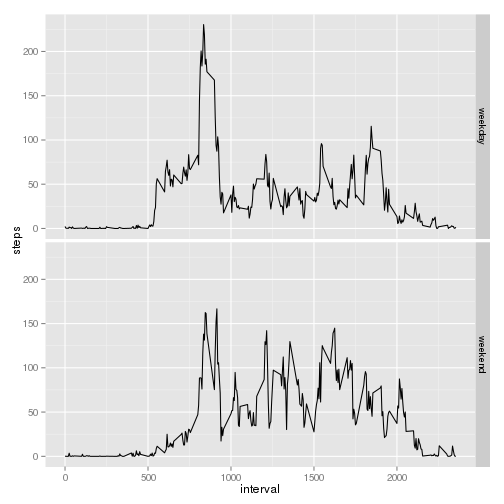

## Loading and preprocessing the data


```r
# load library ggplot2 for plotting
library(ggplot2)
# set locale for date/time to posix (English!)
Sys.setlocale(category="LC_TIME", locale="POSIX")
```

```r
# unzip data if necessary
if( !file.exists( "activity.csv" ) ) {
  unzip( "activity.zip" )
}
# read activity data
activity <- read.csv( "activity.csv" )
```


## What is mean total number of steps taken per day?


```r
# calculate sums of steps for each day
result <- aggregate( steps ~ date, data = activity, FUN = "sum" )
# set output format for numbers
options(scipen = 2, digits = 2)
# calculate mean and median of total steps taken per day
# and plot histogram of steps
with( result, {
  mean_steps <<- round( mean( steps ), digits=2 )
  median_steps <<- round( median( steps ), digits=2 )
  mean_label <- paste("Mean Steps=",mean_steps,sep="")
  median_label <- paste("Median Steps=",median_steps,sep="")
  h <- hist( steps )
  abline( v = median_steps, col="blue" )
  legend(x="topright", legend = c(mean_label, median_label) )
})
```

 

The mean of the total number of steps taken each day is 10766.19. The median is 10765.

## What is the average daily activity pattern?


```r
result2 <- aggregate( steps ~ interval, data = activity, FUN = "mean" )
with(result2, 
  plot(interval, steps, type="l")
)
```

 

```r
max_steps_interval <- result2[result2$steps == max( result2$steps ), 1]
```

The interval with the maximum average steps is interval 835. If we assume that intervals start at midnight (interval 0 / 2400) each day then noon would be at interval  1200. So we see that maximum activity is around 8:30 am.

## Imputing missing values


```r
# get all rows where steps is missing
activity_nas <- activity[is.na(activity$steps),]
# get number of observations with steps missing
count_nas <- nrow(activity_nas)
```

The number of missing step values is 2304.

We'll impute the missing steps values for the intervals from the mean total steps for the intervals. Those can be taken from result2:


```r
# merge result2 with the mean steps of intervals to data frame with missing values
activity2 <- merge(activity_nas, result2, by="interval")
# create new data frame with correct columns/names out of the merged data
activity2 <- data.frame(steps = activity2$steps.y, date = activity2$date, interval = activity2$interval )
# append rows from original data set with the complete observations
activity2 <- rbind(activity2, activity[!is.na(activity$steps),])
# calculate sums of steps for each day
result3 <- aggregate( steps ~ date, data = activity2, FUN = "sum" )
# prevent output in scientific notation
options(scipen = 2, digits = 2)
with( result3, {
  # calculate mean and median of total steps taken per day
  mean_steps <<- round( mean( steps ), 2 )
  median_steps <<- round( median( steps ), 2 )
  # plot histogram of steps
  hist( steps )
})
```

 

The mean of the total number of steps taken each day is 10766.19. The median is 10766.19. So the mean is the same as the one calculated with missing numbers. On the other hand the median has changed and is now the same as the mean. This was to be expected as missing values where imputed with the mean values of the total steps for the intervals.


## Are there differences in activity patterns between weekdays and weekends?

```r
# function to find weekday/weekend factors for weekdays
weekconv <- function(d) {
  res <- "weekday"
  if (d == "Sat" || d == "Sun") {
    res <- "weekend"
  }
  return (res)
}
# make date a Data type
activity2$date <- as.Date(activity2$date)
# add column with days of week names
activity2$weekday <- weekdays(activity2$date, abbreviate = T)
# map days of week to weekday factors with function weekconv()
activity2$weekday <- as.factor(sapply(activity2$weekday, weekconv))
# calculate mean steps per interval and weekday
activity2 <- aggregate(steps ~ interval + weekday, data = activity2, FUN="mean")
# plot steps against interval for weekdays and weekends
qplot(interval, steps, data=activity2, facets = weekday ~ ., geom="line", log="")
```

 

From the comparison of activity patterns between weekdays and weekends it can be seen that activity on weekdays starts earlier in the morning and is higher in the morning time than on weekends. On weekends activity is higher in the afternoon than during the week.


```r
# set date/time local back to system default
Sys.setlocale(locale="")
```

